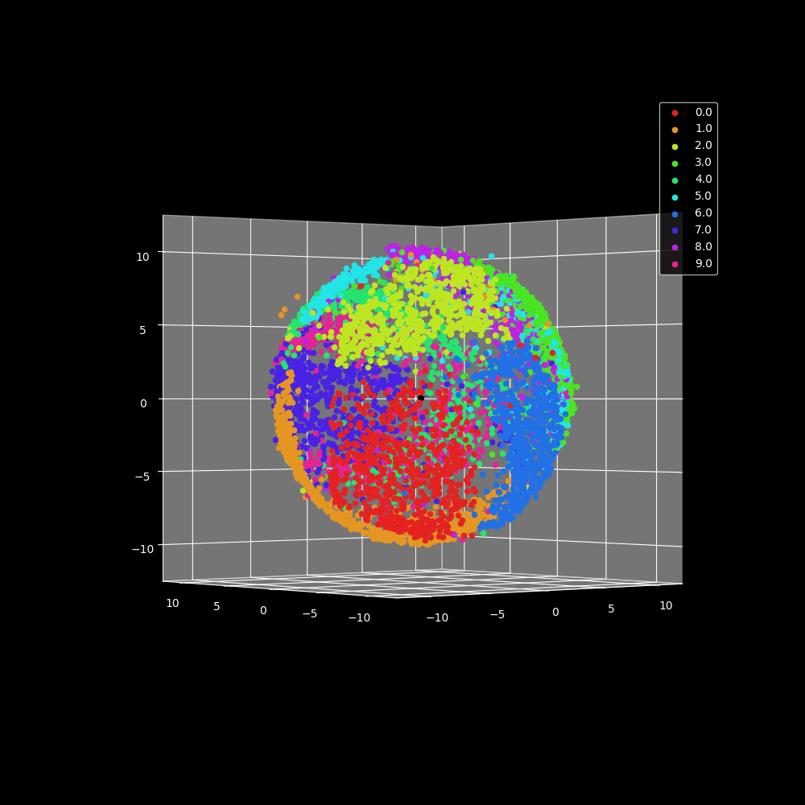

# Tilted Prior

This code is for the tilted prior paper (below) is built from this [repo](https://github.com/XavierXiao/Likelihood-Regret).
> Griffin Floto, Stefan Kremer and Mihai Nica [Exponentially Tilted Gaussian Prior for Variational Autoencoder](https://arxiv.org/pdf/2111.15646.pdf). In arXiv preprint
arXiv:2111.15646, 2021

Below is a visualization of a network latent space that was trained on the MNIST dataset. Each data point corresponds to a $\mu^i$ for a given image $x^i$. For this visualization $d_z =3$ and $\tau =10$. 

  

## Training
The train.py scipt is used to train a VAE with both the standard Gaussian and the tilted prior. It also has options to train with the beta-VAE and the background model as described in the [Likelihood Ratios](https://arxiv.org/abs/1906.02845) paper. Check the argument parser for all the possible training options. The table below shows some useful arguments to get started. Trained model parameters will be saved in the `results/testname` directory along with a graph and numpy files of the loss curve. If `--images True` then reconstructed images and samples will be saved in `results/testname/images`. An information.txt file will also be saved which stores the relevent hyperparameters and training settings.

| Argument | Purpose |
|:------:|:-------:|
| --testname | required, name of folder network is stored |
| --dataset | training dataset (you have to download) |
| --loss | either l2 or cross_entropy |
| --tilt | prior tilt (tau), None for standard VAE |
| --nz | the dimension of the latent space |
| --epochs | number of training epochs |
| --lr | learning rate |
| --ratio | trains the backround model for Likelihood Ratios |
| --perturbed | mu hyperparameter for background model |
| --images | saves image reconstructions and samples |

## Evaluation
There are a total of 4 different scripts which test our method as well as three other competing methods. Using `--testname` will automatically load a trained network along with any information needed for evalution from the information.txt file. The OOD information saves to `results/testname/testtype/aucroc` and stores an ROC plot, histogram, numpy arrays of the OOD scores and a text file of the final AUCROC scores. The tilt.py file runs our method, complexity.py is for [Input Complexity](https://arxiv.org/abs/1909.11480), ratio.py is for [Likelihood Ratios](https://arxiv.org/abs/1906.02845) and regret.py is for [Likelihood Regret](https://arxiv.org/abs/2003.02977). Some useful arguments are shown in the table below.

| Argument | Purpose |
|:------:|:-------:|
| --testname | required, name of folder network is stored |
| --samples | number of OOD samples to test |
| --k | number of images for the IWAE bound |
| --ic_type | png or jp2, for input complexity |
